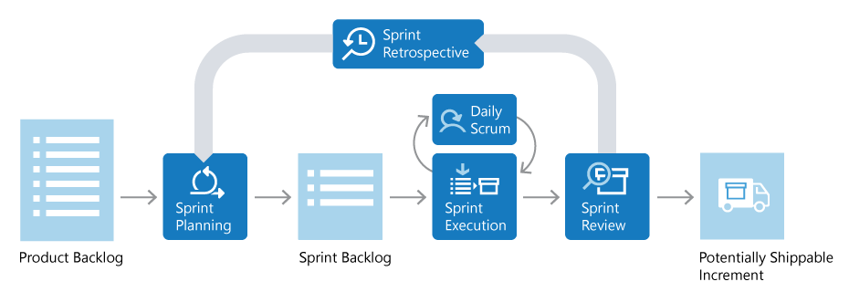
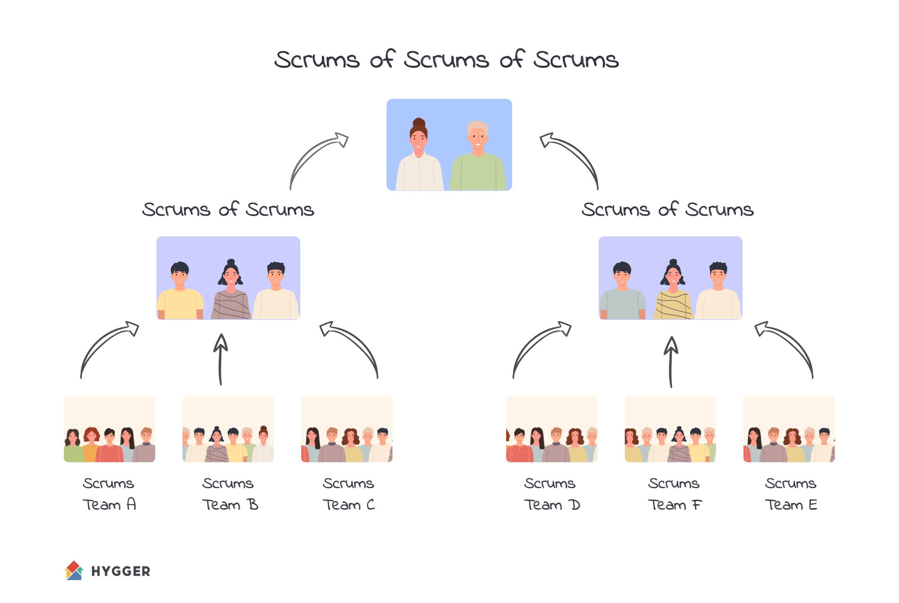
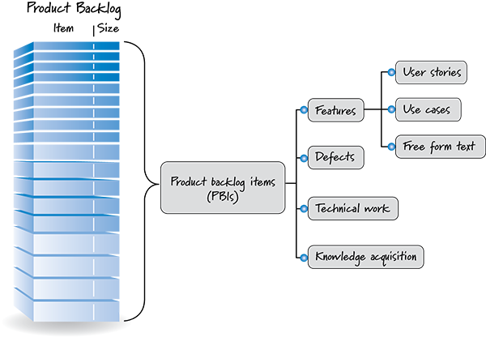
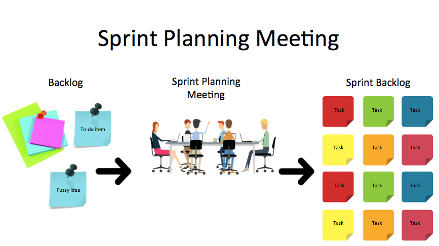
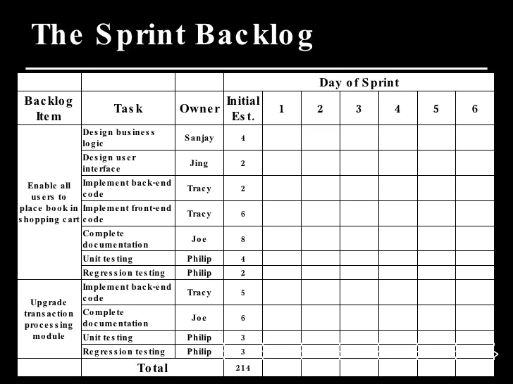
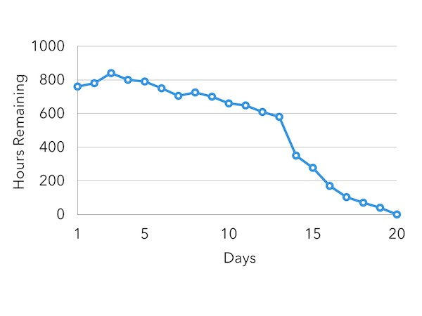
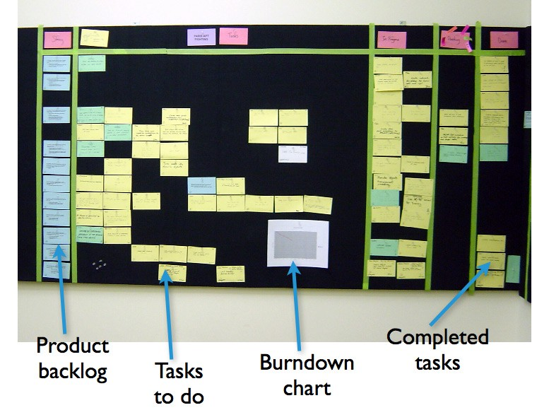

## Reference
- https://docs.microsoft.com/en-us/devops/plan/what-is-scrum
- https://longnguyen.site/t%E1%BB%95ng-quan-v%E1%BB%81-scrum-trong-vi%E1%BB%87c-ph%C3%A1t-tri%E1%BB%83n-ph%E1%BA%A7n-m%E1%BB%81m-theo-ph%C6%B0%C6%A1ng-ph%C3%A1p-agile-a02b1386069b
- https://hygger.io/guides/agile/scrum/scrum-of-scrums/
- https://longnguyen.site/scrum-team-de5d1505b68f
- https://longnguyen.site/scrummaster-tr%C3%B9m-scrum-8929c5df5f5d
- https://longnguyen.site/scrum-product-backlog-636d03902259
- https://longnguyen.site/sprint-planning-meeting-cu%E1%BB%99c-h%E1%BB%8Dp-l%C3%AAn-k%E1%BA%BF-ho%E1%BA%A1ch-8b76f1c84bda
- https://longnguyen.site/daily-scrum-meeting-cu%E1%BB%99c-h%E1%BB%8Dp-h%C3%A0ng-ng%C3%A0y-856aa506d475
- https://longnguyen.site/sprint-backlog-7320951ad47e
- https://pt.slideshare.net/KhushSlideShare/agile-methodologyscrum/23-The_Sprint_Backlog_Day_of
- https://longnguyen.site/scrum-task-board-b%E1%BA%A3ng-c%C3%A1c-c%C3%B4ng-vi%E1%BB%87c-c%E1%BA%A7n-l%C3%A0m-2c1e3205f01a
- https://longnguyen.site/release-burndown-chart-c1c5bb898b3a
- https://longnguyen.site/sprint-review-meeting-cu%E1%BB%99c-h%E1%BB%8Dp-r%C3%BAt-kinh-nghi%E1%BB%87m-968db31b1a5f
- https://longnguyen.site/sprint-retrospective-nh%C3%ACn-l%E1%BA%A1i-3149126b241e

# SCRUM
- [Scrum Overview](#1-scrum-overview)
- [Scrum Team](#2-scrum-team)
- [Product Owner](#3-product-owner)
- [Scrum Master](#4-scrum-master)
- [Scrum Product Backlog](#5-scrum-product-backlog)
- [Sprint Planning Meeting](#6-sprint-planning-meeting)
- [Daily Scrum Meeting](#7-daily-scrum-meeting)
- [Sprint Backlog](#8-sprint-backlog)
- [Scrum Task Board](#9-scrum-task-board)
- [Release Burndown Chart](#10-release-burndown-chart)
- [Sprint Review Meeting](#11-sprint-review-meeting)
- [Sprint Retrospective](#12-sprint-retrospective)

## 1. Scrum Overview
#### What is Scrum?
    - Scrum is the most commonly used method according to the Agile statement applied in product development, especially software products. Calling Agile is a statement because it hasn't materialized into a method. From the Agile statement, people concretize into methods like Scrum, Lean. Scrum is a flexible framework that can be used to manage any project even though its deadlines are tight, its requirements are very complex, or it is highly specialized. With the Scrum method, projects are continued non-stop by repeating an activity period called a Sprint . Each sprint usually lasts 2 to 4 weeks.

#### Phrases used in Scrum:
1. **Scrum team** (a group that follows the Scrum method): 
    - usually a Scrum team has about 5 to 9 people. But it is not excluded that there are projects up to hundreds of people, there are also Scrum teams of only 1 person. These teams will not divide specific roles like in traditional software development teams: programmers, designers, testers or system architects, but people work together to get things done. they committed for 1 Sprint. Team members bond with each other deeply and create a sense of being on the same page.
2. **Product owner** : 
    - The product owner plays a key role in the project, representing the user (user), customer (customer) and others in the process. Product owners often come from people in the product management, marketing team, a key person or an important user.
3. **Scrum Master** (Scrum Process Manager): 
    - is the person responsible for coordinating the team to operate as efficiently as possible. The Scrum Master helps the team to operate according to the Scrum method, removes barriers for the team to work smoothly, protects the team from external obstacles..
4. **Product backlog** : 
    - is a list of product features (features) arranged in order of priority, clearly listing the desired features or improvements of the product. Note: The term “backlog” can be misleading because there are two types of backlogs: (1) **product backlog** is a list of desired product features; (2) **sprint backlog** is a list of to-dos (tasks) to complete a sprint.
5. **Sprint planning meeting** : 
    - Before starting a sprint, the team will hold a sprint planning meeting. Then, the product owner will present the top items (which are the most preferred items) in the product backlog to the team. The team will choose the tasks they can complete within the next 1 sprint. The sprint backlog will contain a list of the tasks that need to be completed in that sprint.
6. **Daily scrum meeting** : 
    - in a sprint, there is a daily scrum meeting called daily scrum. The meeting will tell who's doing what today, keeping everyone on track. Everyone on the team must attend this meeting.
7. **Sprint review meeting (product review meeting)**: 
    - at the end of each sprint, the team will have to present the functionality that has been completed in the sprint review meeting. They have to show what they did in that sprint. Usually it's a demo about a new feature of the product in a casual way, not necessarily a slide or anything. The meeting went on comfortably, nothing complicated.
8. **Sprint retrospective (meeting to learn from each sprint)**: 
    - At the end of each sprint, the team will have to do a sprint retrospective for the entire team (including the Scrum Master and Product owner) to evaluate whether the team did that sprint well, want to change the changes. What can be done better in the next sprint.

## 2. Scrum Team
- A team usually has 5 to 9 people. While not the only way to increase Scrum, one popular technique is to use a “Scrum of Scrums” meeting. This way, the Scrum teams still meet as usual, but each team appoints one person to attend the "Scrum of Scrum" meeting to collaborate with other Scrum teams. Those meetings are like Scrum meetings, but they don't have to happen every day. In many companies, a Scrum of Scrum meetings 2–3 times a week is sufficient.

## 3. Product Owner
- In this article, the phrase "Product owner" refers to "Agile product owner", and product owners that do not follow the Agile statement, I will not discuss here
- The Product Owner plays an important role in a project. Much of the Product Owner's responsibility is to define a vision for the product the team is building, and to communicate that vision to the entire Scrum team. It is the key to a successful start to any Agile software project. The Product owner does it piecemeal through the product backlog .
- Usually, the product owner comes from the lead user of the system, the marketing team, product manager or anyone who is very knowledgeable about users, markets, competitors and future trends of what they are building.
- Although the Product owner is the one who prioritizes the product backlog during sprint planning meetings , it is the whole team that chooses the amount of work they think they will complete in each sprint, and how many sprints need to be done to complete it. all products.

## 4. Scrum Master
- The Scrum Master is the person responsible for ensuring that the Scrum team operates according to the values ​​of the Scrum methodology and implements it. The Scrum Master is seen as a team leader, helping the team do its best work. The Scrum Master is also seen as a process owner for the team, creating a balance with someone who also plays a very important role in the project, the Product Owner .
- The presence of Scrum Master is to help the team run Scrum smoothly. Just imagine a Scrum Master is similar to your home fitness coach, will help you stick to your workout regimen and perform the exercises correctly. A good trainer will motivate you but also ensure that you won't cheat by skipping difficult exercises. However, the power of the coach is limited. Coaches can't force you to do exercises you don't want to. On the contrary, he will remind you of your goals to strive for and guide you on how to achieve them. In addition, the coach himself does not have the right, but the client will give them that right. Scrum Master is similar: they do not have the rights themselves, but the rights are granted by the team themselves.

## 5. Scrum Product Backlog
- The Scrum Agile Product Backlog is a prioritized feature list containing short descriptions of the desired product functionality. When applying the Scrum method , we do not need to start the project by documenting the entire product requirements. Typically, a Scrum team and Product owner will start by writing what they come up with to prioritize the Product backlog . The product backlog is always more than the volume for the first sprint. The Scrum Product backlog will then be continuously developed and changed as the team gets a better understanding of the product and their customers
- A Scrum product backlog typically has the following item types:
    1. Features (features)
    2. Bug or Defect (bug)
    3. Technical work
    4. Knowledge asquisition
- The dominant method for the Scrum team when describing features in the scrum product backlog is to present it in the form of user stories. These are short, simple descriptions of desired features from the user's point of view. For example, “as a shopper, I can review the items in my cart before checkout to see which items I have selected.”
- for example of product backlog: https://longnguyen.site/product-backlog-example-dba1e24a4e6b

    - There is no difference in bug and feature description (each describes something different from what the user wants) so the bug is also placed in the Scrum product backlog.
    - Technical activities and collected knowledge are also included in the backlog. Examples of technical tasks: “Update all dev computers to Windows 7”. Example of knowledge gained: an item in the backlog describing the process of researching different Javascript libraries and then making a decision on which one to choose.
- The product owner presented the prioritized Scrum product backlog in a sprint planning meeting and described the top items to the team. The team will determine which items they can complete in the upcoming sprint. The selected items will be moved from the product backlog to the sprint backlog . Accordingly, the team will convert each item in the product backlog into one or more tasks (to do) in the sprint backlog so that they will divide the work more efficiently during a sprint.

## 6. Sprint Planning Meeting
- During the sprint planning meeting, the product owner will describe to the entire team the features that have been ranked in order of highest priority. Everyone on the team will ask questions to understand the problem, then they will translate the user stories of the product backlog into more detailed tasks in the sprint backlog.
- There are two things that result from each sprint planning meeting:
    1. Goals of the sprint
    2. Sprint backlog

## 7. Daily Scrum Meeting
- In the Scrum methodology , every day of a sprint, the team meets, called "daily scrum". Meetings are usually held at the same time and place. Ideally, the meeting should take place in the morning to define the work to be done for the day. Each meeting lasts up to 15 minutes, which keeps things fast and tidy.
- In the daily scrum, each member only answer the following 3 questions:
    1. What did you do yesterday?
    2. What will you do today?
    3. What is hindering work?

## 8. Sprint Backlog
- The Sprint backlog is a list of work that has been determined by the Scrum team to be completed within a sprint. During a sprint planning meeting , the team selects several items in the product backlog (usually written as user stories), and identifies the tasks that need to be done to complete each user story. Most teams also estimate the time it takes for a team member to complete each task.
- What should be strictly followed is that the team will choose the items and volumes of the sprint backlog. Because they are the ones who will complete the tasks, it is they who choose what to do in the Scrum sprint.
- The sprint backlog is typically tracked with a spreadsheet, but it can also be tracked with a system or any software specifically designed for Scrum or Agile. Here is an example of a sprint backlog in a spreadsheet:

- During a sprint, members must update the sprint backlog as new information becomes available, at least once a day. Many teams do this in daily scrum . Once a day, the remaining workload is calculated and charted by the Scrum Master , forming a sprint burndown chart as shown below.

## 9. Scrum Task Board
-  We will represent the sprint backlog by presenting it on a board called the Scrum Task Board . Team members will continuously update the task board throughout the sprint; If someone comes up with a new task (e.g. Test snark code on Windows 8.1 ), she writes it down on a card and sticks it on the board.

- Here are some common columns used on a taskboard:
    Backlog : user story description (“As a user, I want…”) displayed on each row.
    1. **Todo** : is the place to put the cards that have not started (In Process).
    2. **Doing** : any card being worked on. The programmer who selects this task will move that card to this column as soon as she starts it. Usually this happens during the daily scrum when someone says “I will do boojum today.”
    3. **Testing** : many tasks need corresponding test task. Therefore, if there is a card “Code boojum class”, there will almost be one or more task cards related to testing: “Test boojum”, “Write a Fitnesse test to test boojum”… Some tasks do not have a corresponding test task. . For example, fix bug 321 on Bugzilla , so it will be in the “Testing” column.
    4. **Done** : the cards will be stacked on this column after completion. And it will be removed at the end of the sprint. Sometimes we also remove them even before the end of the sprint, if there are too many cards.
- In addition, we can also use the following columns in a Scrum Task Board, depending on the team, culture, project or some other factors:
    1. **Notes** : where to put the notes.
    2. **Test specified** : we want to do “Story Tests — Driven Development” or “Acceptance Test — Driven Development”, which are tests written for stories before it is programmed. Many teams find it useful when tests are written before coding a particular story. This column contains only a check mark to indicate whether the test has been written or not.

## 10. Release Burndown Chart
- Progress on a Scrum project can be tracked using the tools of a release burndown chart . The Scrum Master should update the release burndown chart at the end of each sprint.

## 11. Sprint Review Meeting
- For each sprint, the team must release an incremental product. That is, at the end of each sprint, the team must deliver a piece of software that has been programmed, tested and can be used stably.
- Therefore, at the end of each sprint, a sprint review meeting will be held. During this meeting, the Scrum team revealed what they accomplished in the last sprint. Often it will take place as a demo of new product features.
- There is usually a rule that prohibits the use of Powerpoint slides and the preparation time for the meeting should not exceed 2 hours. 
- During the sprint review, the project will be evaluated against the sprint goals identified in the sprint planning meeting . Ideally, the team completes each item in the product backlog of the sprint, but more importantly the team must complete the sprint goal.

## 12. Sprint Retrospective
- Sprint retrospectives are usually the last thing to do in each sprint. Many teams often do this right after the sprint review . The entire team, including the Scrum Master and Product Owner, should be involved. Sprint retrospectives of up to 1 hour are sufficient. However, occasionally a hot topic can be raised or a conflict occurs within the team and the sprint retrospective can be longer.
- Using this approach, each team member will be asked what things the team should:
    1. Start doing
    2. Stop working
    3. Keep doing
- After discussing an initial list of ideas, the team will vote on the items to focus on for the next sprint. At the end of the sprint, the next retrospective usually begins with a review of the list of things selected to focus on in the previous sprint retrospective.

